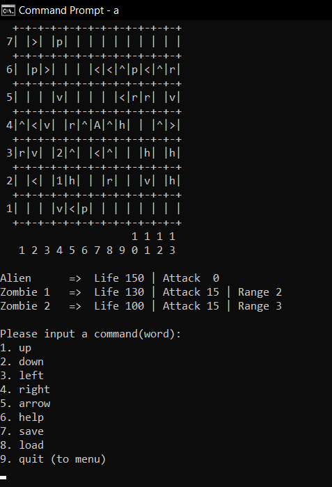
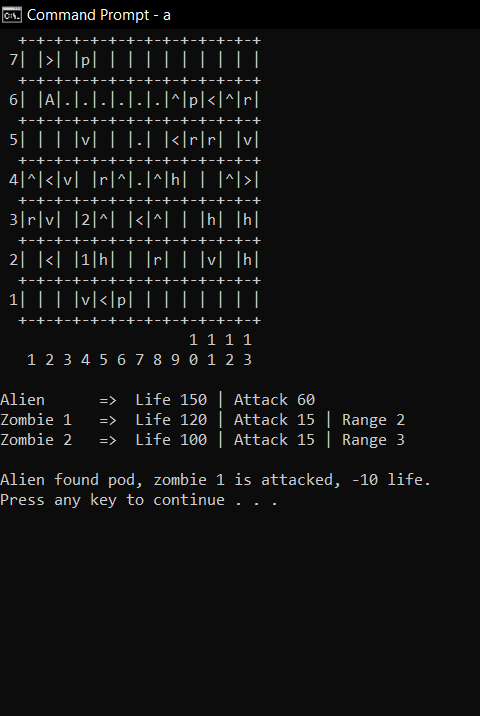
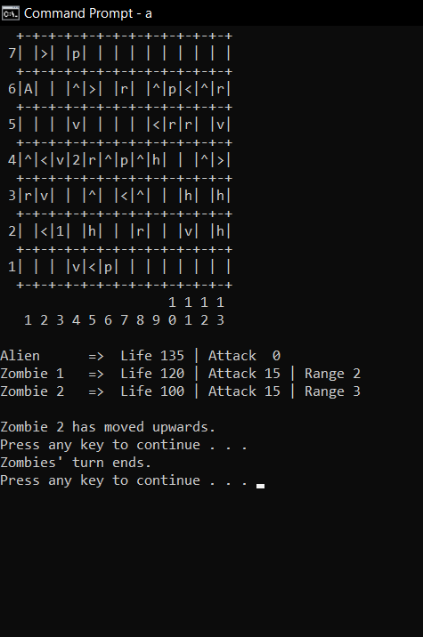

# Alien vs. Zombie

From the guidelines: \
``Alien vs Zombie is a turn-based combat game in which the player controls Alien to defeat a group of
Zombies. Prior to the game, the player can customize settings including game board dimensions and
number of zombies. The player can also save a game into a file and load a game from a file.``

In this project, we tried to create the game in text version, and by using the C++ language. Here are some screenshots of how the program that has been created by our group looks like:







## Compilation Instructions

Ensure that you are in the right directory/folder. If not, copy the folder path where the main.cpp file of this program is located, then type in ```cd (folder path)``` into your command line / terminal, without the brackets.

To compile, type the following in command line / terminal:  
```g++ pf\\*.cpp main.cpp```

## User Manual

Users will need to manually input command to navigate through the program.

The program will show options that are listed with numbers beside them. To navigate to the options / pages, type in commands according to the type stated in the bracket. You may be asked to reinput if the command entered is invalid or does not exist.

## Progress Log

- [Part 1](PART1.md)
- [Part 2](PART2.md)

## Contributors

- Tan Hong Han
- Anadani Muaaz